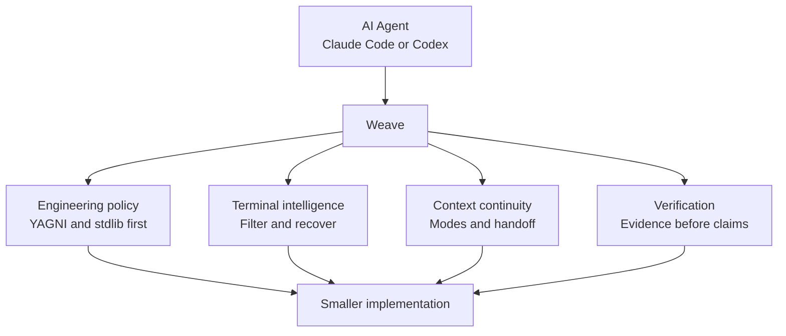
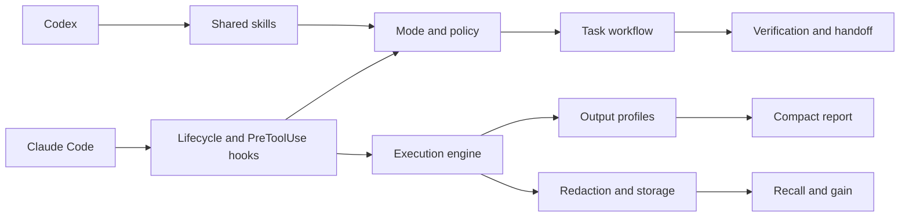

<div align="center">

# WEAVE

### The engineering layer for AI coding agents

Minimal engineering policy, terminal intelligence, context continuity, and verification in one dependency-free plugin.

**Claude Code x Codex x AI Agents**

[Why Weave?](#why-weave) | [See it in action](#see-weave-in-action) | [Architecture](#architecture) | [Benchmarks](#benchmarks) | [Installation](#installation)

[](https://github.com/GabrielKqw/weave/actions/workflows/ci.yml)


</div>

---

## Why Weave?

AI coding agents can solve difficult tasks, but long sessions still accumulate noisy terminal output, repeated context, unnecessary abstractions, and unverifiable completion claims. Weave adds a small engineering layer between the agent and its tools.



Weave combines the useful ideas behind minimal coding discipline and reduced terminal noise without copying Ponytail or RTK code and without depending on either runtime. It uses Node.js standard-library modules only: no daemon, database, MCP server, or third-party package.

## See Weave in Action

```console
$ node bin/weave.js exec -- "git status"
Command: git status
Exit: 0
Summary: git status (boilerplate hints removed)
Failures: none
Omitted: 4 line(s)
Recovery: weave recall 4f12ab90cd34
```

The original command runs unchanged. Weave preserves its exit code, reduces only eligible successful output, and stores a redacted recovery capture when content is omitted.

```text
Agent request
     |
     v
Active Weave mode
     |
     v
Tool call -----> unsupported or unsafe to wrap -----> unchanged
     |
     v
Execute original command
     |
     +---- failure ----> complete stdout and stderr
     |
     +---- success ----> conservative output profile
                              |
                              +---- reduced report
                              +---- redacted recovery capture
```

## Capabilities

| Layer | What it does |
| --- | --- |
| Engineering policy | Understand first, reuse existing code, prefer native features and stdlib, fix shared causes, verify proportionally |
| Modes | Persists `off`, `lite`, `full`, or `ultra` per project |
| Terminal intelligence | Wraps eligible shell calls and removes repetitive successful output |
| Failure integrity | Preserves non-zero exits, stdout, stderr, and diagnostic lines |
| Recovery | Stores redacted complete captures under `.weave/runs/` |
| Context continuity | Maintains a compact `.weave/state.md` handoff |
| Focused operations | Provides review, repository audit, debt, gain, and help skills |

## Architecture



```text
.claude-plugin/       Claude Code manifest and marketplace
.codex-plugin/        Codex manifest
.agents/plugins/      Codex marketplace metadata
bin/weave.js          CLI
core/                 execution, modes, filters, redaction, quoting, storage
hooks/                lifecycle and shell interception adapters
skills/               shared workflow and focused operations
tests/                dependency-free Node.js test suite
```

Hook adapters stay thin. Classification and reduction live in `core/filters.js`; execution and report integrity live in `core/exec.js`; persistence and retention live in `core/storage.js`.

## Modes

The active mode is stored in `.weave/mode` and survives new sessions in the same project.

```text
/weave off
/weave lite
/weave full
/weave ultra
```

| Mode | Behavior |
| --- | --- |
| `off` | Disables Weave task guidance |
| `lite` | Applies short correctness and verification guardrails |
| `full` | Applies the complete minimalism, validation, security, and handoff policy |
| `ultra` | Challenges scope aggressively and requires the smallest adequate result |

The lifecycle hook injects the active policy when a session or subagent starts. Only exact `/weave <mode>` prompts switch modes.

## Terminal Profiles

Weave recognizes:

- Git status, diff, log, branch, stash, fetch, pull, push, add, and commit;
- `rg`, `grep`, directory listings, `find`, and `fd`;
- JavaScript, Python, Rust, Go, .NET, Java, Jest, and Vitest test commands;
- builds, linters, package managers, Docker, Kubernetes, Terraform, and system logs;
- long repetitive output through a conservative fallback.

Small output passes through. Failed commands remain complete. File reads, pagers, head/tail, `sed`, and explicit JSON output remain verbatim. Each captured stream is capped at 20 MB.

## Benchmarks

Representative local measurements from three repeated runs on the terminal engine:

| Scenario | Original | Presented | Reduction | Integrity |
| --- | ---: | ---: | ---: | --- |
| `git status`, 30 untracked files | 704 B | 506 B | 28.1% | File list preserved |
| Synthetic 300-line passing test | 6,210 B | 816 B | 86.9% | Final summary preserved |
| Failing assertion | 98 B | 98 B | 0% | Error and exit 1 preserved |
| `grep`, 50 matches | 1,682 B | 1,335 B | 20.6% | Matches grouped by file |

Measured wrapper overhead was approximately 50-70 ms per command on the test machine. Results vary with output shape, machine, shell, and active profile. These numbers measure bytes presented locally, not API token billing.

Run `node bin/weave.js gain` inside a project to measure its retained Weave history.

## Supported Agents

| Agent | Integration |
| --- | --- |
| Claude Code | Shared skills, lifecycle events, and automatic shell interception |
| Codex CLI | Shared skills and lifecycle policy declared by the plugin manifest |
| Other agents | The CLI can be called directly; automatic host integration is not claimed |

Unsupported hook events fail open, so the original tool call proceeds unchanged.

## Installation

### Requirements

- Node.js 18 or newer;
- Bash on Linux and macOS;
- Git Bash on Windows, or `WEAVE_BASH` pointing to another Bash executable;
- Claude Code or Codex CLI.

### Claude Code

```bash
git clone https://github.com/GabrielKqw/weave.git
cd weave
claude plugin marketplace add ./ --scope project
claude plugin install weave@weave --scope project
claude plugin details weave@weave
node bin/weave.js doctor
```

Project scope avoids modifying global Claude Code configuration.

```bash
claude plugin uninstall weave@weave --scope project
claude plugin marketplace remove weave --scope project
```

### Codex CLI

```bash
git clone https://github.com/GabrielKqw/weave.git
cd weave
codex plugin marketplace add ./
codex plugin add weave@weave
codex plugin list
node bin/weave.js doctor
```

## Configuration

```bash
node bin/weave.js mode
node bin/weave.js mode ultra
node bin/weave.js doctor
node bin/weave.js gain
node bin/weave.js recall <run-id>
```

Run commands from the target repository so modes and history remain project-local.

Weave writes only:

```text
.weave/mode
.weave/state.md
.weave/runs/<id>.json
.weave/runs/<id>.txt
```

History is pruned to 200 runs or 14 days. Recognizable credentials, private keys, authorization headers, and URL credentials are redacted before persistence. Redaction is defense in depth, not a guarantee; secrets should not be printed to a terminal.

## Focused Skills

| Skill | Purpose |
| --- | --- |
| `weave` | Main workflow, validation, context, and handoff |
| `weave-review` | Reviews the current diff for removable complexity |
| `weave-audit` | Audits the repository for confirmed simplifications |
| `weave-debt` | Collects explicit `weave:` debt markers |
| `weave-gain` | Reports measured local output reduction |
| `weave-help` | Shows modes, skills, safety rules, and commands |

Review, audit, debt, and gain are report-only unless the user separately authorizes changes.

## Development

No dependency installation is required.

```bash
npm test
npm run check
claude plugin validate .
```

CI runs the test suite and `doctor` on Linux and Windows.

## Contributing

Keep changes small, dependency-free, and backed by a focused test. Preserve failed-command output and exit status. Do not add a filter unless it can reduce noise without hiding actionable diagnostics.

1. Fork the repository.
2. Create a focused branch.
3. Run `npm run check`.
4. Open a pull request describing the behavior and evidence.

## Project Boundaries

Weave targets the useful overlap of minimal coding discipline and terminal-output reduction. It does not provide line-for-line compatibility with another project, a Codex-to-Claude transport, remote storage, a daemon, automatic delegation, or global installation.

The direction was informed by the public work of [Ponytail](https://github.com/DietrichGebert/ponytail) and [RTK](https://github.com/byx-darwin/rtk). Weave's code, policies, storage format, hooks, and tests are independent.

## License

No license has been declared. All rights remain with the copyright holder until a license is added.
