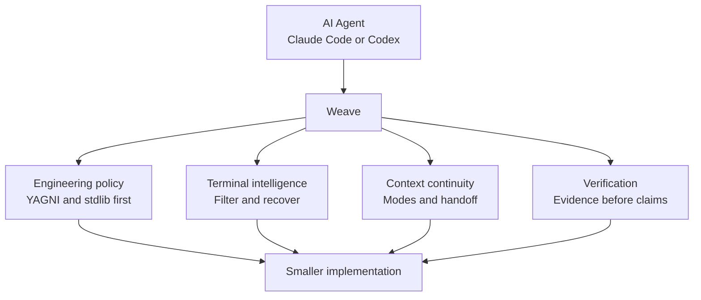
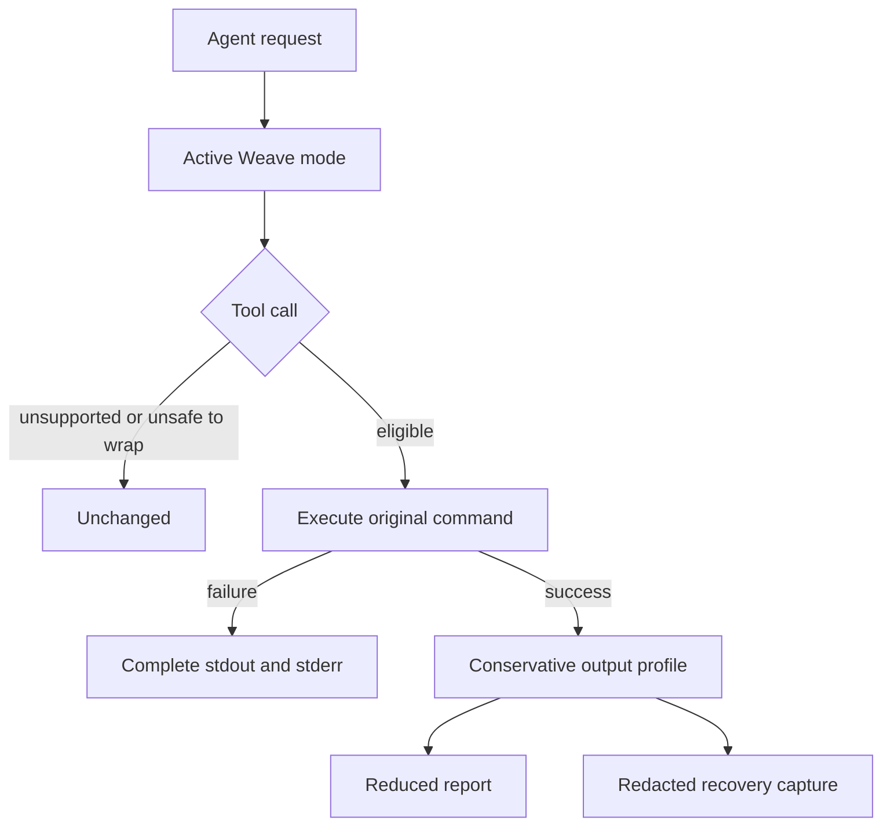
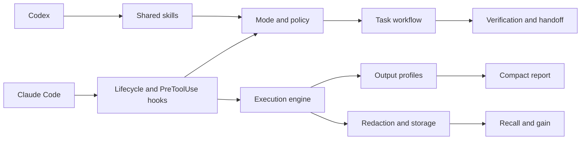

<div align="center">


Minimal engineering policy, terminal intelligence, context continuity, and verification in one dependency-free plugin.

**Claude Code · Codex CLI · Antigravity CLI**

[Why Weave?](#why-weave) | [See it in action](#see-weave-in-action) | [Architecture](#architecture) | [Benchmarks](#benchmarks) | [Installation](#installation)

[](https://github.com/GabrielKqw/weave/actions/workflows/ci.yml)


</div>

---

**[Ler em Português](README.pt-BR.md)**

## Why Weave?

Long agent sessions rot the same way every time: terminal output balloons, the same file gets re-read, an unrequested abstraction creeps in, and "done" gets claimed without proof. Weave is the layer that stops that pattern — one dependency-free plugin that cuts eligible successful output by up to 96.4% (see [Benchmarks](#benchmarks)), keeps a compact `.weave/state.md` handoff between Claude Code and Codex CLI, and enforces reuse-first, evidence-before-claims engineering discipline.



Weave combines the useful ideas behind minimal coding discipline and reduced terminal noise without copying Ponytail or RTK code and without depending on either runtime. The core uses Node.js standard-library modules only: no daemon, database, or third-party package. An optional dependency-free MCP server ships in `mcp/server.js` for MCP-capable clients that have no native Weave plugin (see [MCP server](#mcp-server)).

## See Weave in Action

```console
$ node cli/weave.js exec -- "git status"
Command: git status
Exit: 0
Summary: git status (long file lists condensed)
Failures: none
Omitted: 4 line(s)
Recovery: weave recall 4f12ab90cd34
```

The original command runs unchanged. Weave preserves its exit code, reduces only eligible successful output, and stores a redacted recovery capture when content is omitted.



## Capabilities

| Layer | What it does |
| --- | --- |
| Engineering policy | Understand first, reuse existing code, prefer native features and stdlib, fix shared causes, verify proportionally |
| Modes | Persists `off`, `lite`, `full`, or `ultra` per project |
| Terminal intelligence | Wraps eligible shell calls and removes repetitive successful output |
| Failure integrity | Preserves non-zero exits, stdout, stderr, and diagnostic lines |
| Recovery | Stores redacted complete captures under `.weave/runs/` |
| Context continuity | Guides agents to maintain a compact request contract and working memory in `.weave/state.md` |
| Context snapshots | `weave memory` saves, loads, lists, and inspects named memory snapshots under `.weave/memories/` |
| Redundant read prevention | `hooks/preread.js` tracks file reads and searches in `.weave/ledger.json`, warning on unchanged re-reads |
| Secret redaction | Automatically scrubs API tokens, private keys, database URLs, and Bearer headers from stored captures |
| Focused operations | Provides review, repository audit, debt, gain, and help skills |
| Multi-agent rule files | Generates the same policy text for Cursor, Cline, Windsurf, and any `AGENTS.md`-reading agent |
| MCP server | Serves policy, gain, and discover over stdio JSON-RPC for MCP-capable clients without a native plugin integration |
| Retrospective analysis | `weave discover` estimates reduction missed in past sessions that ran outside the wrapper |

## Architecture



```text
.claude-plugin/       Claude Code manifest and marketplace
.codex-plugin/        Codex manifest
.agents/plugins/      Codex marketplace metadata
cli/weave.js          CLI
core/                 execution, modes, filters, redaction, quoting, storage, discover, memory
hooks/                lifecycle and shell interception adapters
skills/               shared workflow and focused operations
mcp/server.js         dependency-free MCP server (stdio) for non-plugin clients
commands/weave.toml   OpenCode-style slash command
scripts/              agent rule generator, reproducible benchmark, benchmark chart
docs/benchmark.svg    generated chart of the benchmark table below (not hand-edited)
tests/                dependency-free Node.js test suite
```

Hook adapters stay thin. Classification and reduction live in `core/filters.js`; execution and report integrity live in `core/exec.js`; persistence and retention live in `core/storage.js`; named context snapshots live in `core/memory.js`.

## Modes

The active mode is stored in `.weave/mode` and survives new sessions in the same project.

```text
/weave off
/weave lite
/weave full
/weave ultra
```

| Mode | Behavior |
| --- | --- |
| `off` | Disables Weave task guidance |
| `lite` | Applies short correctness and verification guardrails |
| `full` | Applies the complete minimalism, validation, security, and handoff policy |
| `ultra` | Challenges scope aggressively and requires the smallest adequate result |

The lifecycle hook injects the active policy when a session or subagent starts. A mode switches only on an exact prompt: `/weave <mode>`, `@weave <mode>`, `$weave <mode>`, or `weave mode <mode>` to switch, and `stop weave` or `normal mode` to turn it off.

## Terminal Profiles

Weave intercepts eligible shell commands and applies conservative, domain-specific reduction profiles:

* **Git Commands**:
  * `git status`: Condenses long lists of untracked and modified files per section, while stripping verbose hint boilerplate (e.g. `(use "git add <file>..." to include in what will be committed)`).
  * `git diff`: Strips noisy index lines (e.g. `index 1234..5678 100644`), while preserving all diff hunks completely intact.
  * `git log`: Condenses multi-line commits to one-line entries. Graph output (`--graph`) and explicit formats are left untouched.
  * `git branch`, `stash`, `fetch`, `pull`, `push`, `add`, `commit`: Passed through or condensed cleanly without noise.
* **Test Runners**:
  * Supports Node.js test runner (`node --test`), Jest, Vitest, Playwright, Python (`pytest`, `unittest`), Rust (`cargo test`), Go (`go test`), .NET, Java (`mvn test`, `gradle test`), and Ruby (`rspec`, `rake test`).
  * On success (`exit 0`): Collapses hundreds of repetitive passing lines into the final test summary, achieving up to 96.4% output reduction.
  * On failure (`exit != 0`): **Never reduced.** The entire failure output, assertion diffs, and stack traces are preserved verbatim.
* **Code Search**:
  * Supports `grep`, `ripgrep` (`rg`), `find`, and `fd`.
  * Groups repeated matches under their respective file headers, eliminating repetitive path prefixes.
* **Package Managers**:
  * Supports `npm`, `pnpm`, `yarn`, `bun`, `pip`, and `cargo` (including `install`, `outdated`, and `list`).
  * Condenses repetitive dependency trees and progress output, keeping actionable warnings and version tables.
* **Linters & Formatters**:
  * Supports Prettier and ESLint: clean formatting runs are condensed; syntax errors and lint violations are surfaced immediately.
* **Infrastructure & Cloud**:
  * Supports Docker, Kubernetes (`kubectl`), Terraform, and system log outputs.
* **GitHub CLI**:
  * `gh pr`, `gh run`, `gh issue`: Condensed to concise tables.
  * `gh api`: Always kept verbatim as structured JSON.
* **Generic Fallback**:
  * Collapses consecutive identical lines with a repetition count.
  * Truncates oversized repetitive middle sections while keeping head lines and tail summaries intact.

### Output Integrity Guarantees

1. **Failure Integrity**: Any command with a non-zero exit code preserves 100% of its stdout, stderr, and diagnostics.
2. **Passthrough for Small Output**: Short outputs that do not exceed the profile threshold pass through unchanged.
3. **Verbatim by Design**: File reads (`cat`, `head`, `tail`), pagers (`less`), `sed`, and explicit JSON output are never altered.
4. **Safety Cap**: Every captured stream is capped at 20 MB. Raw captured logs are scrubbed of secrets before saving to `.weave/runs/`.

## Benchmarks

`scripts/benchmark.js` runs the same `computeReport()` used by real execution (`core/exec.js`, backed by `core/filters.js`) against fixed synthetic inputs — no shell, no I/O — so these numbers are reproducible by anyone and can't silently drift from what `weave exec` actually presents:

```bash
npm run benchmark
```


`docs/benchmark.svg` is generated from these same numbers by `node scripts/generate-benchmark-chart.js` (checked for drift by `npm run check`) - it can't show anything the table below doesn't.

| Scenario | Original | Presented | Reduction | Integrity |
| --- | ---: | ---: | ---: | --- |
| `git status`, 30 untracked files | 555 B | 429 B | 22.7% | File count preserved, long lists condensed |
| Synthetic 300-line passing test | 6,465 B | 232 B | 96.4% | Final summary preserved |
| Failing assertion | 60 B | 60 B | 0% | Error and exit 1 preserved |
| `grep`, 50 matches | 2,031 B | 1,846 B | 9.1% | Matches grouped by file |

Results vary with output shape, machine, and active profile in real usage; the script fixes the input so the reduction logic itself stays measurable across changes. These numbers measure bytes presented locally, not API token billing.

Run `node cli/weave.js gain` inside a project to measure its retained Weave history, or `node cli/weave.js discover` to estimate savings missed before Weave was wrapping commands.

## Supported Agents

| Agent | Integration |
| --- | --- |
| Claude Code | Shared skills, lifecycle events, and automatic shell interception |
| Codex CLI | Shared skills and lifecycle policy (mode injection) via the plugin manifest. Automatic shell interception is not currently supported in Codex CLI |
| Antigravity CLI (`agy`) | Shared skills and policy via `AGENTS.md`/`GEMINI.md`. Automatic shell interception is not currently supported in Antigravity CLI |
| Other agents | The CLI can be called directly; automatic host integration is not claimed |

Unsupported hook events fail open, so the original tool call proceeds unchanged.

### Rule-file agents

Cursor, Cline, Windsurf, and any agent that reads a repository-level `AGENTS.md` don't run Weave's hooks, so they get the same `full`-mode policy text as a static, checked-in file instead:

```text
AGENTS.md
.cursor/rules/weave.mdc
.clinerules/weave.md
.windsurf/rules/weave.md
```

All four are generated from the single source of truth in `core/mode.js` — there is exactly one place the wording is written:

```bash
node scripts/generate-agent-rules.js          # regenerate after changing core/mode.js
node scripts/generate-agent-rules.js --check  # CI: fail if the checked-in files drifted
```

`npm run check` runs the drift check automatically.

### MCP server

`mcp/server.js` is a dependency-free MCP server over stdio (JSON-RPC 2.0, newline-delimited) for MCP-capable clients that have no native Weave plugin — it exposes `get_policy`, `gain`, and `discover` as tools, backed by the same `core/` modules the CLI uses. Point any MCP client at:

```json
{
  "mcpServers": {
    "weave": { "command": "node", "args": ["<plugin-root>/mcp/server.js"] }
  }
}
```


## Installation

### Requirements

- Node.js 18 or newer;
- Bash on Linux and macOS;
- Git Bash on Windows, or `WEAVE_BASH` pointing to another Bash executable;
- Claude Code or Codex CLI.

### Claude Code

```bash
claude plugin marketplace add GabrielKqw/weave --scope user
claude plugin install weave@weave --scope user
claude plugin details weave@weave
```

Claude Code keeps a managed local checkout of the Git marketplace. Update it from the plugin screen or from the terminal, then restart Claude Code:

```bash
claude plugin update weave@weave --scope user
```

To uninstall:

```bash
claude plugin uninstall weave@weave --scope user
claude plugin marketplace remove weave --scope user
```

### Codex CLI

```bash
codex plugin marketplace add GabrielKqw/weave
codex plugin add weave@weave
codex plugin list
```

Refresh the managed Git marketplace checkout with:

```bash
codex plugin marketplace upgrade weave
```

### Antigravity CLI

Install from a local clone of the repository:

```bash
git clone https://github.com/GabrielKqw/weave.git
cd weave
agy plugin install ./
```

Alternatively, place or link the checkout into `~/.gemini/config/plugins/weave` or `.agents/plugins/weave`. Antigravity CLI loads Weave's skills and project rules (`GEMINI.md`/`AGENTS.md`) automatically.

### Local development

Use a local marketplace only when developing Weave itself:

```bash
git clone https://github.com/GabrielKqw/weave.git
cd weave
claude plugin marketplace add ./ --scope project
claude plugin install weave@weave --scope project
node cli/weave.js doctor
```

### Standalone (no Claude Code or Codex)

The package has no runtime dependency and is npm-packagable for agents and editors that use neither plugin marketplace. It is not yet published to the npm registry; install locally from a clone:

```bash
git clone https://github.com/GabrielKqw/weave.git
cd weave
npm pack
npm install --global ./weave-agent-workflow-0.5.1.tgz
weave doctor
```

Then either call `weave exec -- <command>` yourself or point an MCP client at `mcp/server.js` (see [MCP server](#mcp-server)).

## CLI Commands & Subcommands

Weave provides a direct CLI (`weave` or `node cli/weave.js`) for inspection, configuration, and execution:

| Command | Usage | Description |
| --- | --- | --- |
| `doctor` | `weave doctor [--agent=...]` | Verifies Node.js runtime, bash executable, plugin manifests, and directory write permissions |
| `mode` | `weave mode [off\|lite\|full\|ultra]` | Displays the active engineering policy mode or updates it in `.weave/mode` |
| `exec` | `weave exec -- <command>` | Executes a command through Weave's output reduction filters, preserving exit codes and errors verbatim |
| `gain` | `weave gain [--history]` | Displays measured output byte reduction and estimated tokens saved from recorded runs |
| `recall` | `weave recall <run-id>` | Prints the raw, unreduced captured output for a past run by its 12-character ID |
| `discover` | `weave discover` | Analyzes local un-wrapped session transcripts to estimate potential compressible output |
| `memory` | `weave memory <subcommand>` | Manages named snapshots of `.weave/state.md` under `.weave/memories/` |

### Detailed Command Reference

#### `weave doctor`
Checks the local environment for compatibility:
* Node.js version (requires `>=18`).
* Bash availability (Git Bash on Windows or system `bash` on Linux/macOS; reports `WARN` instead of `FAIL` for agents like Antigravity and Codex that do not require bash for execution).
* Plugin manifests integrity (`.claude-plugin/`, `.codex-plugin/`, `.agents/plugins/`, `GEMINI.md`, `hooks/hooks.json`).
* Writable `.weave/` directory for local project state.

#### `weave mode [off|lite|full|ultra]`
Inspects or switches the active mode stored in `.weave/mode`:
* Without arguments: prints the current active mode.
* With a mode name: updates `.weave/mode` to `off`, `lite`, `full`, or `ultra`.

#### `weave exec -- <command>`
Runs `<command>` as a child process:
* Non-zero exits (failures): Output is preserved 100% untouched.
* Zero exits (success): Output matching a terminal profile (test runners, git, grep, npm, etc.) is condensed.
* If lines are omitted, the raw output is saved to `.weave/runs/<id>.raw.txt` and a recovery command is displayed.

#### `weave gain [--history]`
Reports measured local savings from all recorded runs in `.weave/runs/`:
* `weave gain`: prints aggregate summary (commands recorded, raw stream bytes, report bytes, reduction %, approximate tokens saved).
* `weave gain --history`: prints a tabular log of every individual run with timestamp, command kind, exit status, and byte counts.

#### `weave recall <run-id>`
Retrieves the original output of an omitted command using the 12-character run ID displayed during execution (e.g. `weave recall 4f12ab90cd34`).

#### `weave discover`
Reads local session transcripts (`~/.claude/projects/<slug>/*.jsonl`), finds shell commands that ran outside the Weave wrapper, and calculates how many bytes could have been saved. Does not execute commands or modify files.

#### `weave memory <subcommand>`
Captures, restores, and inspects named context snapshots stored in `.weave/memories/<name>.md`:
* `weave memory save <name> [file]`: copies `.weave/state.md` (or a custom source file) into `.weave/memories/<name>.md`.
* `weave memory load <name>`: restores `.weave/memories/<name>.md` into `.weave/state.md`.
* `weave memory list`: lists all saved memory snapshots with size and modification date.
* `weave memory show <name>`: prints the contents of `<name>.md` to stdout without overwriting `.weave/state.md`.
* `weave memory delete <name>` (or `rm`): removes `.weave/memories/<name>.md`.
* Security: Memory names are restricted to `[a-zA-Z0-9_.-]`, reject `..` and path separators, and refuse to read or write through symbolic links (`fs.lstatSync`).

---

## Context Continuity and the Request Contract (`.weave/state.md`)

Weave structures working memory and agent handoffs through a lightweight, human-readable file at `.weave/state.md`. It keeps the session grounded and prevents context loss:

```markdown
# Request contract

- Goal: Clear, concise definition of the desired outcome.
- Constraints: Hard requirements (e.g. standard library only, zero dependencies, backward compatibility).
- Required: Essential deliverables that must be built.
- Not requested: Out-of-scope items and speculative abstractions (YAGNI guardrail).
- Completion criteria: Explicit, testable evidence required before claiming completion.

## Working memory
- Architectural decisions, file paths, discovered quirks, and reproducible test commands.
```

---

## Redundant Read and Search Prevention (`hooks/preread.js`)

In long coding sessions, agents frequently re-read the same unchanged files or re-run identical searches, consuming thousands of tokens without new information.

Weave tracks tool calls in `.weave/ledger.json`:
* **File Reads (`Read`)**: Records the file path and modification timestamp. If an agent re-reads an unchanged file, Weave injects a reminder to consult Working Memory instead of re-reading.
* **Exact Searches (`Grep`, `Glob`)**: Tracks identical consecutive queries and flags them if the filesystem has not changed.
* Ledger entries are project-local and automatically pruned.

---

## Storage, Privacy, & Redaction

Weave writes only project-local files inside `.weave/`:

```text
.weave/
├── mode                  # Active policy mode (off, lite, full, ultra)
├── state.md              # Active request contract and working memory
├── memories/             # Saved context snapshots (<name>.md)
├── runs/                 # Redacted reports (<id>.json) and raw outputs (<id>.raw.txt)
└── ledger.json           # Read and search deduplication tracking
```

### Security & Secret Redaction
Before any output is written to disk in `.weave/runs/`:
* AWS Access Key IDs (`AKIA...`) are replaced with `[REDACTED_AWS_KEY]`.
* GitHub personal access tokens (`ghp_...`, `github_pat_...`) are replaced with `[REDACTED_GITHUB_TOKEN]`.
* `Authorization: Bearer <token>` headers are sanitized.
* Database URLs, private keys (`BEGIN PRIVATE KEY`), and generic password/secret assignments are scrubbed.
* History is automatically pruned to a maximum of 200 runs or 14 days.

Whether to commit `.weave/state.md` is a per-project choice: commit it when the team shares the contract and working memory; gitignore it when it is used as local scratchpad context. Never write credentials or sensitive data into `.weave/state.md`.

## Focused Skills

| Skill | Purpose |
| --- | --- |
| `weave` | Main workflow, validation, context, and handoff |
| `weave-review` | Reviews the current diff for removable complexity |
| `weave-audit` | Audits the repository for confirmed simplifications |
| `weave-debt` | Collects explicit `weave:` debt markers |
| `weave-gain` | Reports measured local output reduction |
| `weave-help` | Shows modes, skills, safety rules, and commands |

Review, audit, debt, and gain are report-only unless the user separately authorizes changes.

## Development

No dependency installation is required.

```bash
npm test
npm run check
claude plugin validate .
```

CI runs the test suite and `doctor` on Linux and Windows.

## Contributing

Keep changes small, dependency-free, and backed by a focused test. Preserve failed-command output and exit status. Do not add a filter unless it can reduce noise without hiding actionable diagnostics.

1. Fork the repository.
2. Create a focused branch.
3. Run `npm run check`.
4. Open a pull request describing the behavior and evidence.

## Project Boundaries

Weave targets the useful overlap of minimal coding discipline and terminal-output reduction. It does not provide line-for-line compatibility with another project, a Codex-to-Claude transport, remote storage, a daemon, automatic delegation, or automatic/host-wide installation across projects. You can still `npm install --global` the CLI yourself from a local clone (see [Standalone](#standalone-no-claude-code-or-codex)) — Weave just never does that for you.

The direction was informed by the public work of [Ponytail](https://github.com/DietrichGebert/ponytail) and [RTK](https://github.com/byx-darwin/rtk). Weave's code, policies, storage format, hooks, and tests are independent.

## License

Licensed under the [MIT License](LICENSE).


<div align="center">


**Weave** — the engineering layer for AI coding agents

[GitHub](https://github.com/GabrielKqw/weave) &middot; [LinkedIn](https://www.linkedin.com/in/gabriel-costa-940b89276/) &middot; Discord `tanjas1`

Created by **Gabriel Costa**

</div>
