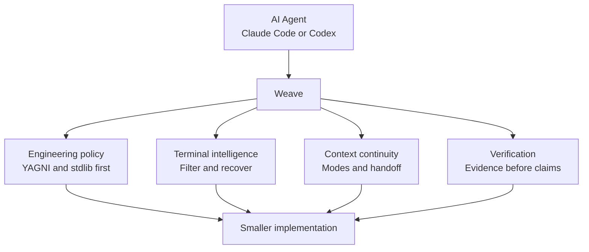
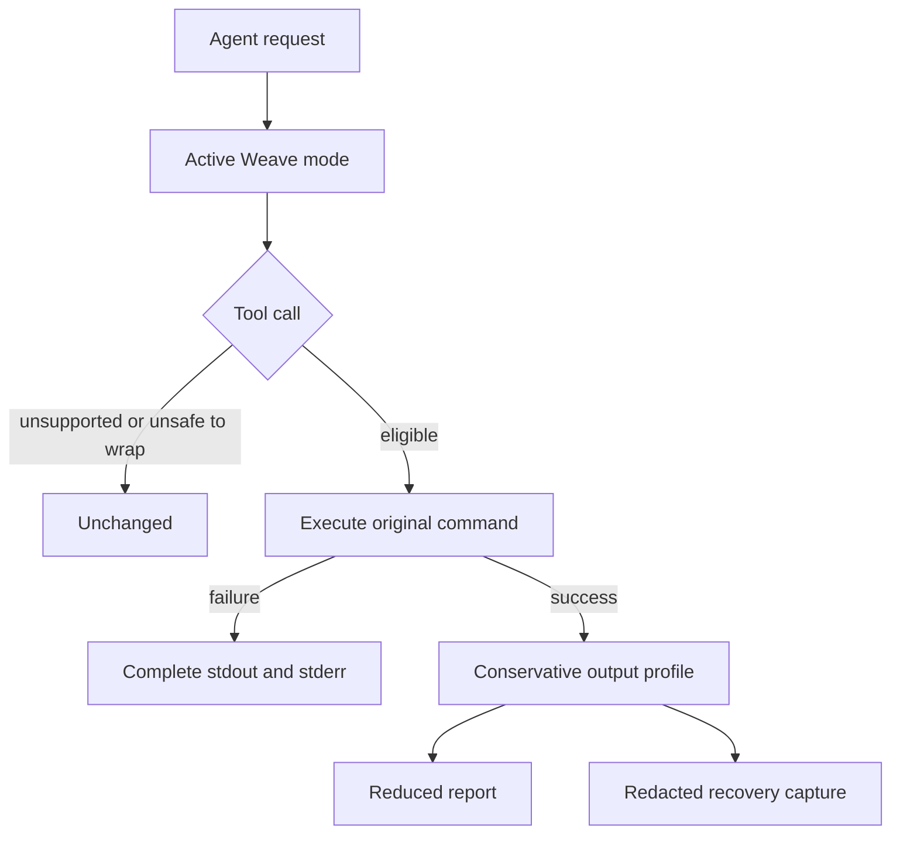
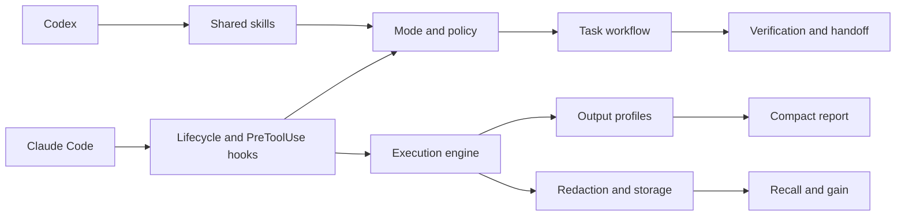

<div align="center">


Minimal engineering policy, terminal intelligence, context continuity, and verification in one dependency-free plugin.

**Claude Code x Codex x AI Agents**

[Why Weave?](#why-weave) | [See it in action](#see-weave-in-action) | [Architecture](#architecture) | [Benchmarks](#benchmarks) | [Installation](#installation)

[](https://github.com/GabrielKqw/weave/actions/workflows/ci.yml)


</div>

---

**[Ler em Português](README.pt-BR.md)**

## Why Weave?

AI coding agents can solve difficult tasks, but long sessions still accumulate noisy terminal output, repeated context, unnecessary abstractions, and unverifiable completion claims. Weave adds a small engineering layer between the agent and its tools.



Weave combines the useful ideas behind minimal coding discipline and reduced terminal noise without copying Ponytail or RTK code and without depending on either runtime. It uses Node.js standard-library modules only: no daemon, database, MCP server, or third-party package.

## See Weave in Action

```console
$ node cli/weave.js exec -- "git status"
Command: git status
Exit: 0
Summary: git status (boilerplate hints removed)
Failures: none
Omitted: 4 line(s)
Recovery: weave recall 4f12ab90cd34
```

The original command runs unchanged. Weave preserves its exit code, reduces only eligible successful output, and stores a redacted recovery capture when content is omitted.



## Capabilities

| Layer | What it does |
| --- | --- |
| Engineering policy | Understand first, reuse existing code, prefer native features and stdlib, fix shared causes, verify proportionally |
| Modes | Persists `off`, `lite`, `full`, or `ultra` per project |
| Terminal intelligence | Wraps eligible shell calls and removes repetitive successful output |
| Failure integrity | Preserves non-zero exits, stdout, stderr, and diagnostic lines |
| Recovery | Stores redacted complete captures under `.weave/runs/` |
| Context continuity | Maintains a compact `.weave/state.md` handoff |
| Focused operations | Provides review, repository audit, debt, gain, and help skills |
| Multi-agent rule files | Generates the same policy text for Cursor, Cline, Windsurf, and any `AGENTS.md`-reading agent |
| MCP server | Serves policy, gain, and discover over stdio JSON-RPC for MCP-capable clients without a native plugin integration |
| Retrospective analysis | `weave discover` estimates reduction missed in past sessions that ran outside the wrapper |

## Architecture



```text
.claude-plugin/       Claude Code manifest and marketplace
.codex-plugin/        Codex manifest
.agents/plugins/      Codex marketplace metadata
cli/weave.js          CLI
core/                 execution, modes, filters, redaction, quoting, storage, discover
hooks/                lifecycle and shell interception adapters
skills/               shared workflow and focused operations
mcp/server.js         dependency-free MCP server (stdio) for non-plugin clients
commands/weave.toml   OpenCode-style slash command
scripts/              agent rule generator, reproducible benchmark, benchmark chart
docs/benchmark.svg    generated chart of the benchmark table below (not hand-edited)
tests/                dependency-free Node.js test suite
```

Hook adapters stay thin. Classification and reduction live in `core/filters.js`; execution and report integrity live in `core/exec.js`; persistence and retention live in `core/storage.js`.

## Modes

The active mode is stored in `.weave/mode` and survives new sessions in the same project.

```text
/weave off
/weave lite
/weave full
/weave ultra
```

| Mode | Behavior |
| --- | --- |
| `off` | Disables Weave task guidance |
| `lite` | Applies short correctness and verification guardrails |
| `full` | Applies the complete minimalism, validation, security, and handoff policy |
| `ultra` | Challenges scope aggressively and requires the smallest adequate result |

The lifecycle hook injects the active policy when a session or subagent starts. Only exact `/weave <mode>` prompts switch modes.

## Terminal Profiles

Weave recognizes:

- Git status, diff, log, branch, stash, fetch, pull, push, add, and commit;
- `rg`, `grep`, directory listings, `find`, and `fd`;
- JavaScript, Python, Rust, Go, .NET, Java, Ruby (RSpec, Rake), Jest, Vitest, and Playwright test commands;
- builds, linters, formatters (Prettier), package managers (npm/pnpm/yarn/bun/pip/cargo, including `outdated`/`list`), Docker, Kubernetes, Terraform, and system logs;
- GitHub CLI (`gh pr`, `gh run`, `gh issue` condensed; `gh api` kept verbatim as structured JSON);
- long repetitive output through a conservative fallback.

Small output passes through. If a reduced report would be as large as the original output, Weave returns the original output and records zero savings. Failed commands remain complete. File reads, pagers, head/tail, `sed`, and explicit JSON output remain verbatim. Each captured stream is capped at 20 MB.

## Benchmarks

`scripts/benchmark.js` runs `core/filters.js` against fixed synthetic inputs — no shell, no I/O — so these numbers are reproducible by anyone:

```bash
npm run benchmark
```


`docs/benchmark.svg` is generated from these same numbers by `node scripts/generate-benchmark-chart.js` (checked for drift by `npm run check`) - it can't show anything the table below doesn't.

| Scenario | Original | Presented | Reduction | Integrity |
| --- | ---: | ---: | ---: | --- |
| `git status`, 30 untracked files | 555 B | 490 B | 11.7% | File list preserved |
| Synthetic 300-line passing test | 6,465 B | 83 B | 98.7% | Final summary preserved |
| Failing assertion | 60 B | 60 B | 0% | Error and exit 1 preserved |
| `grep`, 50 matches | 2,031 B | 1,676 B | 17.5% | Matches grouped by file |

Results vary with output shape, machine, and active profile in real usage; the script fixes the input so the reduction logic itself stays measurable across changes. These numbers measure bytes presented locally, not API token billing.

Run `node cli/weave.js gain` inside a project to measure its retained Weave history, or `node cli/weave.js discover` to estimate savings missed before Weave was wrapping commands.

## Supported Agents

| Agent | Integration |
| --- | --- |
| Claude Code | Shared skills, lifecycle events, and automatic shell interception |
| Codex CLI | Shared skills and lifecycle policy (mode injection) via the plugin manifest. Automatic shell interception is not currently supported in Codex CLI |
| Other agents | The CLI can be called directly; automatic host integration is not claimed |

Unsupported hook events fail open, so the original tool call proceeds unchanged.

### Rule-file agents

Cursor, Cline, Windsurf, and any agent that reads a repository-level `AGENTS.md` don't run Weave's hooks, so they get the same `full`-mode policy text as a static, checked-in file instead:

```text
AGENTS.md
.cursor/rules/weave.mdc
.clinerules/weave.md
.windsurf/rules/weave.md
```

All four are generated from the single source of truth in `core/mode.js` — there is exactly one place the wording is written:

```bash
node scripts/generate-agent-rules.js          # regenerate after changing core/mode.js
node scripts/generate-agent-rules.js --check  # CI: fail if the checked-in files drifted
```

`npm run check` runs the drift check automatically.

### MCP server

`mcp/server.js` is a dependency-free MCP server over stdio (JSON-RPC 2.0, newline-delimited) for MCP-capable clients that have no native Weave plugin — it exposes `get_policy`, `gain`, and `discover` as tools, backed by the same `core/` modules the CLI uses. Point any MCP client at:

```json
{
  "mcpServers": {
    "weave": { "command": "node", "args": ["<plugin-root>/mcp/server.js"] }
  }
}
```

## Installation

### Requirements

- Node.js 18 or newer;
- Bash on Linux and macOS;
- Git Bash on Windows, or `WEAVE_BASH` pointing to another Bash executable;
- Claude Code or Codex CLI.

### Claude Code

```bash
claude plugin marketplace add GabrielKqw/weave --scope user
claude plugin install weave@weave --scope user
claude plugin details weave@weave
```

Claude Code keeps a managed local checkout of the Git marketplace. Update it from the plugin screen or from the terminal, then restart Claude Code:

```bash
claude plugin update weave@weave --scope user
```

To uninstall:

```bash
claude plugin uninstall weave@weave --scope user
claude plugin marketplace remove weave --scope user
```

### Codex CLI

```bash
codex plugin marketplace add GabrielKqw/weave
codex plugin add weave@weave
codex plugin list
```

Refresh the managed Git marketplace checkout with:

```bash
codex plugin marketplace upgrade weave
```

### Local development

Use a local marketplace only when developing Weave itself:

```bash
git clone https://github.com/GabrielKqw/weave.git
cd weave
claude plugin marketplace add ./ --scope project
claude plugin install weave@weave --scope project
node cli/weave.js doctor
```

### Standalone (no Claude Code or Codex)

The package has no runtime dependency and is npm-packagable for agents and editors that use neither plugin marketplace. It is not yet published to the npm registry; install locally from a clone:

```bash
git clone https://github.com/GabrielKqw/weave.git
cd weave
npm pack
npm install --global ./weave-agent-workflow-0.5.0.tgz
weave doctor
```

Then either call `weave exec -- <command>` yourself or point an MCP client at `mcp/server.js` (see [MCP server](#mcp-server)).

## Configuration

```bash
node cli/weave.js mode
node cli/weave.js mode ultra
node cli/weave.js doctor
node cli/weave.js gain
node cli/weave.js gain --history
node cli/weave.js discover
node cli/weave.js recall <run-id>
```

`gain --history` lists every recorded run (timestamp, kind, exit code, original vs. presented bytes, redacted command) instead of just the aggregate.

`discover` reads this project's local Claude Code session transcripts (`~/.claude/projects/<slug>/*.jsonl`), finds Bash commands that ran without the Weave wrapper (mode was off, or the session predates installation), and replays their recorded output through the current filters to estimate missed savings. It never prints raw commands or output — only byte counts grouped by command kind. If no transcript directory exists (Codex-only projects, CI, fresh installs) it says so and exits cleanly.

Run commands from the target repository so modes and history remain project-local.

Weave writes only:

```text
.weave/mode
.weave/state.md
.weave/runs/<id>.json
.weave/runs/<id>.txt
```

History is pruned to 200 runs or 14 days. Recognizable credentials, private keys, authorization headers, and URL credentials are redacted before persistence. Redaction is defense in depth, not a guarantee; secrets should not be printed to a terminal.

## Focused Skills

| Skill | Purpose |
| --- | --- |
| `weave` | Main workflow, validation, context, and handoff |
| `weave-review` | Reviews the current diff for removable complexity |
| `weave-audit` | Audits the repository for confirmed simplifications |
| `weave-debt` | Collects explicit `weave:` debt markers |
| `weave-gain` | Reports measured local output reduction |
| `weave-help` | Shows modes, skills, safety rules, and commands |

Review, audit, debt, and gain are report-only unless the user separately authorizes changes.

## Development

No dependency installation is required.

```bash
npm test
npm run check
claude plugin validate .
```

CI runs the test suite and `doctor` on Linux and Windows.

## Contributing

Keep changes small, dependency-free, and backed by a focused test. Preserve failed-command output and exit status. Do not add a filter unless it can reduce noise without hiding actionable diagnostics.

1. Fork the repository.
2. Create a focused branch.
3. Run `npm run check`.
4. Open a pull request describing the behavior and evidence.

## Project Boundaries

Weave targets the useful overlap of minimal coding discipline and terminal-output reduction. It does not provide line-for-line compatibility with another project, a Codex-to-Claude transport, remote storage, a daemon, automatic delegation, or global installation.

The direction was informed by the public work of [Ponytail](https://github.com/DietrichGebert/ponytail) and [RTK](https://github.com/byx-darwin/rtk). Weave's code, policies, storage format, hooks, and tests are independent.

## License

Created by **Gabriel Costa**. Contact: [LinkedIn](https://www.linkedin.com/in/gabriel-costa-940b89276/) or Discord `tanjas1`.

Licensed under the [MIT License](LICENSE).
