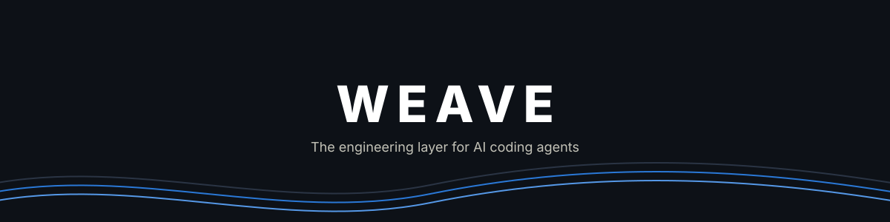
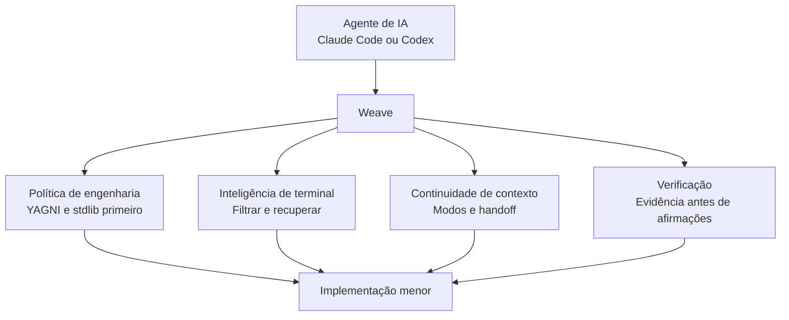
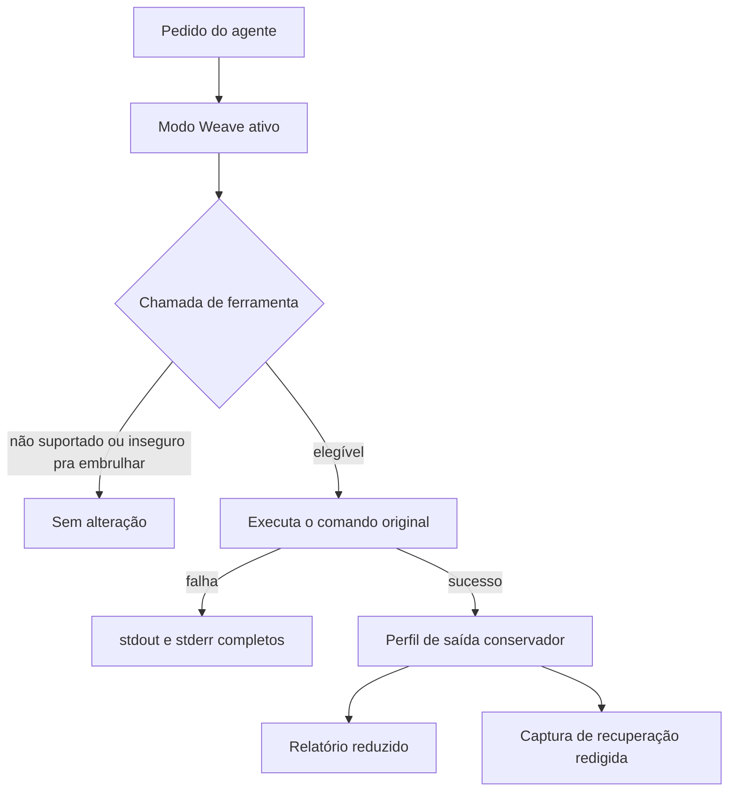
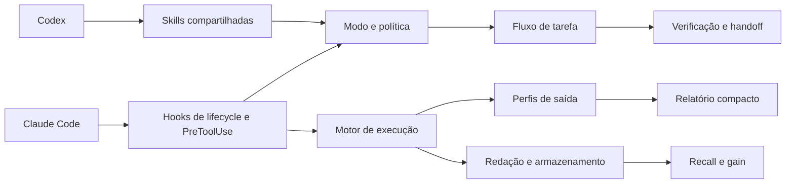
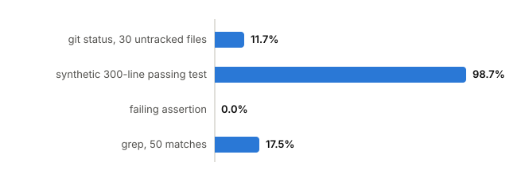

<div align="center">



Política mínima de engenharia, inteligência de terminal, continuidade de contexto e verificação em um único plugin sem dependências.

**Claude Code · Codex CLI · Antigravity CLI**

[Por que o Weave?](#por-que-o-weave) | [Veja em ação](#veja-o-weave-em-ação) | [Arquitetura](#arquitetura) | [Benchmarks](#benchmarks) | [Instalação](#instalação)

[](https://github.com/GabrielKqw/weave/actions/workflows/ci.yml)


</div>

---

**[Read this in English](README.md)**

## Por que o Weave?

Sessões longas de agentes apodrecem sempre do mesmo jeito: a saída de terminal incha, o mesmo arquivo é relido, uma abstração não pedida se infiltra, e "pronto" é declarado sem prova. O Weave é a camada que interrompe esse padrão — um único plugin sem dependências que corta a saída bem-sucedida elegível em até 96,4% (veja [Benchmarks](#benchmarks)), mantém um handoff compacto em `.weave/state.md` entre Claude Code e Codex CLI, e aplica uma disciplina de engenharia baseada em reaproveitamento primeiro e evidência antes de afirmações.



O Weave combina as ideias úteis por trás da disciplina mínima de código e da redução de ruído de terminal, sem copiar código do Ponytail ou do RTK e sem depender de nenhum dos dois em tempo de execução. O núcleo usa apenas módulos da biblioteca padrão do Node.js: sem daemon, banco de dados ou pacote de terceiros. Um servidor MCP opcional e sem dependências vem embutido em `mcp/server.js` para clientes com suporte a MCP que não têm um plugin nativo do Weave (veja [Servidor MCP](#servidor-mcp)).

## Veja o Weave em Ação

```console
$ node cli/weave.js exec -- "git status"
Command: git status
Exit: 0
Summary: git status (long file lists condensed)
Failures: none
Omitted: 4 line(s)
Recovery: weave recall 4f12ab90cd34
```

O comando original roda sem alterações. O Weave preserva seu código de saída, reduz apenas a saída bem-sucedida elegível, e guarda uma captura de recuperação redigida quando algum conteúdo é omitido.



## Capacidades

| Camada | O que faz |
| --- | --- |
| Política de engenharia | Entende primeiro, reaproveita código existente, prefere recursos nativos e stdlib, corrige causas compartilhadas, verifica proporcionalmente |
| Modos | Persiste `off`, `lite`, `full`, ou `ultra` por projeto |
| Inteligência de terminal | Embrulha chamadas de shell elegíveis e remove saída repetitiva bem-sucedida |
| Integridade de falha | Preserva saídas não-zero, stdout, stderr e linhas de diagnóstico |
| Recuperação | Guarda capturas completas redigidas em `.weave/runs/` |
| Continuidade de contexto | Orienta Claude Code e Codex CLI a manter um handoff compacto em `.weave/state.md` |
| Operações focadas | Fornece skills de review, auditoria de repositório, débito, ganho e ajuda |
| Arquivos de regra multi-agente | Gera o mesmo texto de política pro Cursor, Cline, Windsurf, e qualquer agente que leia `AGENTS.md` |
| Servidor MCP | Serve `get_policy`, `gain` e `discover` via stdio JSON-RPC pra clientes com capacidade MCP sem integração nativa de plugin |
| Análise retrospectiva | `weave discover` estima a redução perdida em sessões passadas que rodaram fora do wrapper |

## Arquitetura



```text
.claude-plugin/       Manifesto e marketplace do Claude Code
.codex-plugin/        Manifesto do Codex
.agents/plugins/      Metadados de marketplace do Codex
cli/weave.js          CLI
core/                 execução, modos, filtros, redação, quoting, storage, discover
hooks/                adaptadores de lifecycle e interceptação de shell
skills/               workflow compartilhado e operações focadas
mcp/server.js         servidor MCP sem dependências (stdio) para clientes sem plugin
commands/weave.toml   comando de barra no estilo OpenCode
scripts/              gerador de regras de agente, benchmark reproduzível, gráfico de benchmark
docs/benchmark.svg    gráfico gerado da tabela de benchmark abaixo (não editado à mão)
tests/                suíte de testes Node.js sem dependências
```

Os adaptadores de hook ficam enxutos. Classificação e redução vivem em `core/filters.js`; execução e integridade do relatório vivem em `core/exec.js`; persistência e retenção vivem em `core/storage.js`.

## Modos

O modo ativo é armazenado em `.weave/mode` e sobrevive a novas sessões no mesmo projeto.

```text
/weave off
/weave lite
/weave full
/weave ultra
```

| Modo | Comportamento |
| --- | --- |
| `off` | Desativa a orientação de tarefa do Weave |
| `lite` | Aplica diretrizes curtas de correção e verificação |
| `full` | Aplica a política completa de minimalismo, validação, segurança e handoff |
| `ultra` | Questiona o escopo agressivamente e exige o menor resultado adequado |

O hook de lifecycle injeta a política ativa quando uma sessão ou subagente inicia. O modo só troca com um prompt exato: `/weave <modo>`, `@weave <modo>`, `$weave <modo>`, ou `weave mode <modo>` para trocar, e `stop weave` ou `normal mode` para desativar.

## Perfis de Terminal

O Weave reconhece:

- Git status, diff, log, branch, stash, fetch, pull, push, add e commit;
- `rg`, `grep`, listagens de diretório, `find` e `fd`;
- comandos de teste de JavaScript, Python, Rust, Go, .NET, Java, Ruby (RSpec, Rake), Jest, Vitest e Playwright;
- builds, linters, formatadores (Prettier), gerenciadores de pacote (npm/pnpm/yarn/bun/pip/cargo, incluindo `outdated`/`list`), Docker, Kubernetes, Terraform e logs de sistema;
- GitHub CLI (`gh pr`, `gh run`, `gh issue` condensados; `gh api` mantido verbatim como JSON estruturado);
- saída longa e repetitiva através de um fallback conservador.

Saída pequena passa direto. Se um relatório reduzido ficasse do mesmo tamanho que a saída original, o Weave retorna a saída original e registra economia zero. Comandos que falham permanecem completos. Leitura de arquivos, pagers, head/tail, `sed` e saída JSON explícita permanecem verbatim. Cada stream capturado é limitado a 20 MB.

## Benchmarks

`scripts/benchmark.js` roda o mesmo `computeReport()` usado na execução real (`core/exec.js`, apoiado em `core/filters.js`) contra entradas sintéticas fixas — sem shell, sem I/O — então esses números são reproduzíveis por qualquer pessoa e não podem divergir silenciosamente do que o `weave exec` realmente apresenta:

```bash
npm run benchmark
```



`docs/benchmark.svg` é gerado a partir desses mesmos números por `node scripts/generate-benchmark-chart.js` (verificado quanto a desvio pelo `npm run check`) — não pode mostrar nada que a tabela abaixo não mostre.

| Cenário | Original | Apresentado | Redução | Integridade |
| --- | ---: | ---: | ---: | --- |
| `git status`, 30 arquivos não rastreados | 555 B | 429 B | 22,7% | Contagem de arquivos preservada, listas longas condensadas |
| Teste sintético de 300 linhas, passando | 6.465 B | 232 B | 96,4% | Resumo final preservado |
| Asserção falhando | 60 B | 60 B | 0% | Erro e exit 1 preservados |
| `grep`, 50 correspondências | 2.031 B | 1.846 B | 9,1% | Correspondências agrupadas por arquivo |

Os resultados variam com o formato da saída, a máquina e o perfil ativo no uso real; o script fixa a entrada para que a própria lógica de redução permaneça mensurável entre mudanças. Esses números medem bytes apresentados localmente, não faturamento de tokens de API.

Rode `node cli/weave.js gain` dentro de um projeto para medir seu histórico retido do Weave, ou `node cli/weave.js discover` para estimar a economia perdida antes do Weave estar embrulhando os comandos.

## Agentes Suportados

| Agente | Integração |
| --- | --- |
| Claude Code | Skills compartilhadas, eventos de lifecycle e interceptação automática de shell |
| Codex CLI | Skills compartilhadas e política de lifecycle (injeção de modo) via o manifesto do plugin. Interceptação automática de shell não é suportada atualmente no Codex CLI |
| Antigravity CLI (`agy`) | Skills compartilhadas e política via `AGENTS.md`/`GEMINI.md`. Interceptação automática de shell não é suportada atualmente no Antigravity CLI |
| Outros agentes | O CLI pode ser chamado diretamente; integração automática com o host não é reivindicada |

Eventos de hook não suportados falham de forma aberta, então a chamada de ferramenta original prossegue sem alterações.

### Agentes de arquivo de regras

Cursor, Cline, Windsurf, e qualquer agente que leia um `AGENTS.md` no nível do repositório não rodam os hooks do Weave, então eles recebem o mesmo texto de política do modo `full` como um arquivo estático, já commitado:

```text
AGENTS.md
.cursor/rules/weave.mdc
.clinerules/weave.md
.windsurf/rules/weave.md
```

Os quatro são gerados a partir da fonte única de verdade em `core/mode.js` — existe exatamente um lugar onde o texto é escrito:

```bash
node scripts/generate-agent-rules.js          # regenera após mudar core/mode.js
node scripts/generate-agent-rules.js --check  # CI: falha se os arquivos commitados desviaram
```

`npm run check` roda essa verificação de desvio automaticamente.

### Servidor MCP

`mcp/server.js` é um servidor MCP sem dependências sobre stdio (JSON-RPC 2.0, delimitado por linha) para clientes com capacidade MCP que não têm um plugin nativo do Weave — expõe `get_policy`, `gain`, e `discover` como tools, apoiado pelos mesmos módulos de `core/` que o CLI usa. Aponte qualquer cliente MCP para:

```json
{
  "mcpServers": {
    "weave": { "command": "node", "args": ["<plugin-root>/mcp/server.js"] }
  }
}
```


## Instalação

### Requisitos

- Node.js 18 ou mais recente;
- Bash no Linux e macOS;
- Git Bash no Windows, ou `WEAVE_BASH` apontando para outro executável Bash;
- Claude Code ou Codex CLI.

### Claude Code

```bash
claude plugin marketplace add GabrielKqw/weave --scope user
claude plugin install weave@weave --scope user
claude plugin details weave@weave
```

O Claude Code mantém um checkout local gerenciado do marketplace Git. Atualize pela tela de plugins ou pelo terminal, depois reinicie o Claude Code:

```bash
claude plugin update weave@weave --scope user
```

Para desinstalar:

```bash
claude plugin uninstall weave@weave --scope user
claude plugin marketplace remove weave --scope user
```

### Codex CLI

```bash
codex plugin marketplace add GabrielKqw/weave
codex plugin add weave@weave
codex plugin list
```

Atualize o checkout gerenciado do marketplace Git com:

```bash
codex plugin marketplace upgrade weave
```

### Antigravity CLI

```bash
agy plugin install <caminho>
```

### Desenvolvimento local

Use um marketplace local apenas quando estiver desenvolvendo o próprio Weave:

```bash
git clone https://github.com/GabrielKqw/weave.git
cd weave
claude plugin marketplace add ./ --scope project
claude plugin install weave@weave --scope project
node cli/weave.js doctor
```

### Standalone (sem Claude Code ou Codex)

O pacote não tem dependência de runtime e é empacotável via npm para agentes e editores que não usam nenhum dos dois marketplaces de plugin. Ainda não foi publicado no registro do npm; instale localmente a partir de um clone:

```bash
git clone https://github.com/GabrielKqw/weave.git
cd weave
npm pack
npm install --global ./weave-agent-workflow-0.5.1.tgz
weave doctor
```

Depois, chame `weave exec -- <comando>` você mesmo, ou aponte um cliente MCP para `mcp/server.js` (veja [Servidor MCP](#servidor-mcp)).

## Configuração

```bash
node cli/weave.js mode
node cli/weave.js mode ultra
node cli/weave.js doctor
node cli/weave.js gain
node cli/weave.js gain --history
node cli/weave.js discover
node cli/weave.js recall <run-id>
```

`gain --history` lista todo run registrado (timestamp, tipo, código de saída, bytes originais vs. apresentados, comando redigido) em vez de só o agregado.

`discover` lê as transcrições de sessão locais do Claude Code deste projeto (`~/.claude/projects/<slug>/*.jsonl`), encontra comandos Bash que rodaram sem o wrapper do Weave (modo estava `off`, ou a sessão é anterior à instalação), e reproduz a saída registrada através dos filtros atuais para estimar a economia perdida. Nunca imprime comandos ou saída brutos — só contagens de bytes agrupadas por tipo de comando. Se não existir diretório de transcrições (projetos só-Codex, CI, instalações novas), ele diz isso e encerra normalmente.

Rode os comandos a partir do repositório alvo para que modos e histórico permaneçam locais ao projeto.

O Weave escreve apenas:

```text
.weave/mode
.weave/state.md
.weave/runs/<id>.json
.weave/runs/<id>.raw.txt
```

O histórico é podado para 200 runs ou 14 dias. Credenciais reconhecíveis, chaves privadas, cabeçalhos de autorização e credenciais em URL são redigidos antes da persistência. A redação é uma defesa em profundidade, não uma garantia; segredos não deveriam ser impressos num terminal.

Versionar `.weave/state.md` é uma escolha por projeto: versione quando o handoff entre Claude Code e Codex CLI deve ser compartilhado com o time e revisado como qualquer outro arquivo; coloque no `.gitignore` quando for contexto local ou o repositório ainda não tiver uma convenção. Siga a convenção do próprio repositório quando já existir uma, e nunca escreva segredos ali, seja qual for a escolha.

## Skills Focadas

| Skill | Propósito |
| --- | --- |
| `weave` | Workflow principal, validação, contexto e handoff |
| `weave-review` | Revisa o diff atual em busca de complexidade removível |
| `weave-audit` | Audita o repositório em busca de simplificações confirmadas |
| `weave-debt` | Coleta marcadores explícitos de débito `weave:` |
| `weave-gain` | Reporta a redução de saída local medida |
| `weave-help` | Mostra modos, skills, regras de segurança e comandos |

Review, audit, debt e gain só geram relatório, a menos que o usuário autorize mudanças separadamente.

## Desenvolvimento

Nenhuma instalação de dependência é necessária.

```bash
npm test
npm run check
claude plugin validate .
```

O CI roda a suíte de testes e o `doctor` no Linux e no Windows.

## Contribuindo

Mantenha as mudanças pequenas, sem dependências, e apoiadas por um teste focado. Preserve a saída e o status de saída de comandos que falham. Não adicione um filtro a menos que ele consiga reduzir ruído sem esconder diagnósticos acionáveis.

1. Faça um fork do repositório.
2. Crie uma branch focada.
3. Rode `npm run check`.
4. Abra um pull request descrevendo o comportamento e a evidência.

## Limites do Projeto

O Weave visa a sobreposição útil entre disciplina mínima de código e redução de saída de terminal. Não oferece compatibilidade linha-a-linha com outro projeto, um transporte Codex-para-Claude, armazenamento remoto, um daemon, delegação automática, ou instalação automática/global entre projetos. Você ainda pode rodar `npm install --global` na própria CLI a partir de um clone local (veja [Standalone](#standalone-sem-claude-code-ou-codex)) — o Weave só nunca faz isso por você.

A direção foi informada pelo trabalho público do [Ponytail](https://github.com/DietrichGebert/ponytail) e do [RTK](https://github.com/byx-darwin/rtk). O código, as políticas, o formato de armazenamento, os hooks e os testes do Weave são independentes.

## Licença

Licenciado sob a [Licença MIT](LICENSE).


<div align="center">


**Weave** — a camada de engenharia para agentes de codificação com IA

[GitHub](https://github.com/GabrielKqw/weave) &middot; [LinkedIn](https://www.linkedin.com/in/gabriel-costa-940b89276/) &middot; Discord `tanjas1`

Criado por **Gabriel Costa**

</div>
